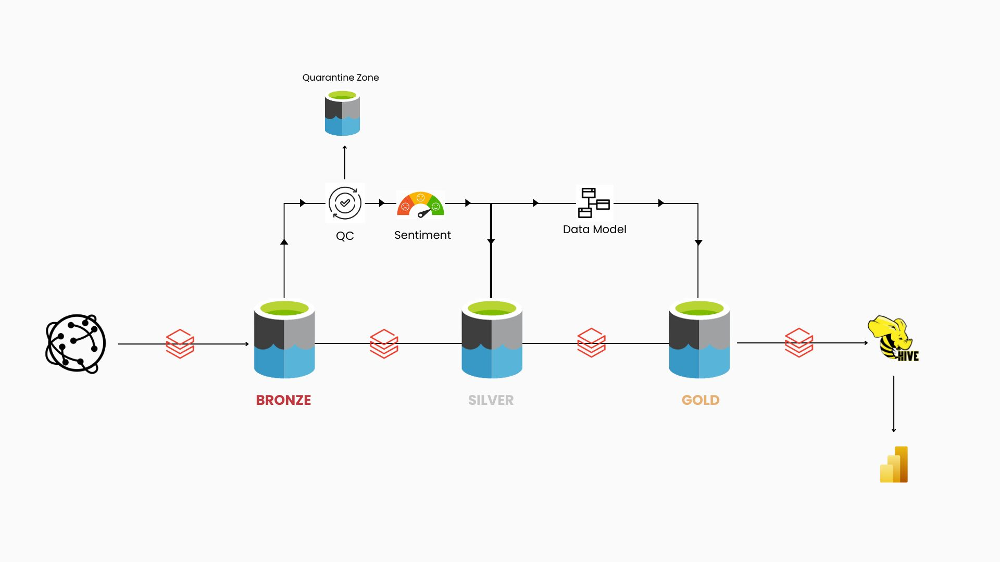

# 📰 News Data Pipeline Project

An end-to-end data engineering pipeline built on Databricks using PySpark, Delta Lake, and Hive Metastore. This project ingests news articles from an API, performs data quality checks, applies sentiment analysis, models the data into fact/dim structures, and exposes clean gold-layer datasets for analytics.


---

## 📽️ Watch the Demo
[](https://www.youtube.com/watch?v=R-oXsJLPYcQ)

---

## 🔧 Architecture Overview

```bash
    API → Bronze (Raw Delta) → DQ Checks & Quarantine → Silver (Clean, Enriched) → Gold (Fact/Dim Model) → Hive Metastore → BI Tools
```

<p align="center">
  
  <br/>
  <em>Figure: Medallion Architecture for News Ingestion and Analysis</em>
</p>

----

## 🧱 Tech Stack

- **Databricks** (Notebooks, Delta Lake, Spark, Hive)  
- **Azure Data Lake Gen2** (`abfss`)  
- **PySpark** (UDFs, DataFrame ops)  
- **TextBlob** (Sentiment analysis)  
- **Hive Metastore / Unity Catalog**  

---


---

## ⚙️ Features

- ✅ Dynamic DQ Rules: Configurable per table  
- ✅ Sentiment Analysis: TextBlob-based polarity & label  
- ✅ Data Modeling: Fact and dimension tables with surrogate keys  
- ✅ Hive Integration: Auto-creates schemas, saves tables  
- ✅ Quarantine Zone: Bad records stored with reason metadata  

---

## 🚀 How to Run

1. Clone repo & open in Databricks  
2. Run `01_bronze_ingestion_news_articles` to pull from API  
3. Run `02_silver_transformation_news_articles` for cleaning + DQ + sentiment analysis 
4. Run `03_gold_modeling_news_articles` to build gold model  
5. Use `_lib_dq_helpers` reusable functions   

---

## 📊 Gold Layer Tables

- `fact_news_articles`  
- `dim_author`  
- `dim_source`  
- `dim_date`  

---

## 📜 License
MIT License

---

## 🙌 Credits
Built by **[David Ezekiel]** with ❤️ on Databricks


